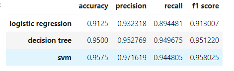
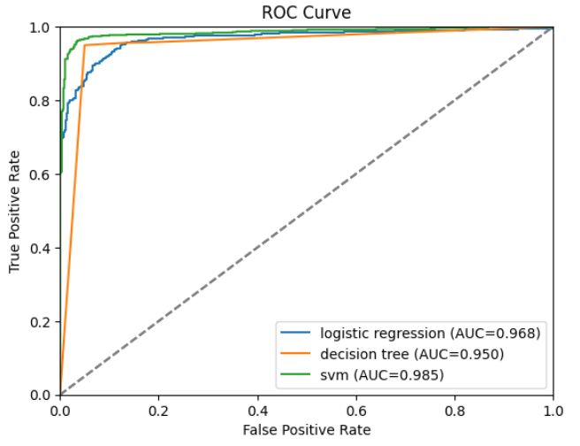
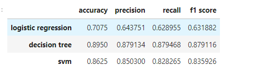

##                           Detection of Attacks on Power System Grids

**Author:** Yiheng Lu (yl15u20)  
**Student ID:** 32181566

### 1 Introduction

This coursework aims to 

- understand the power system attacks on electric grids CPS

- understand the type of attacks

- develop machine learning techniques for detecting these attacks

- get familiar with some programming skills

[Link to Github](https://github.com/rarapazii/COMP3217-CW2)

I have two versions of code. To get the best performance, you can just run the complex version(using Hyperparameter) via jupyter book. It will take about 2h to finish running so I uploaded the the version that runs already completed. 

  

### 2 Problem

For these two parts, the data contains 128 features. It was collected by 4 phasor measurement units(PMU) and each PMU will produce 29 types of measurements. The left 12 columns are control panel logs, snort alerts and relay logs of the 4 PMU/relay.

#### 2.1 Part A

In this part, we only consider two types of scenarios occurred in system. **0** represents normal events and **1** represents abnormal data injection attack events. And now, we are given 6,000 labeled training instances and each class has the same instances. At last, 100 unlabeled system traces are given and we need to compute labels for them. Then, the problem can be summarized as building  a model using 6,000 labeled system traces and making prediction on 100 system traces with no labels. Therefore, it is a common binary classification problem.

#### 2.2 Part B

In this part, we will consider three types of scenarios occurred in system. $0$ represents normal events, **1** represents abnormal data injection attack events and **2** represents abnormal command injection attack events. Similarly, we are also given 6,000 training instances and each class also contains the same instances. At last, 100 unlabeled system traces are given and we need to compute labels for them.  Then, the problem can be summarized as building  a model using 6,000 labeled system traces and making prediction on 100 system traces with no labels. Therefore, it is a common binary classification problem. Therefore, it is a common multiple class classification problem. Comparing these two parts, we can see the classification problem is just from coarse-grained to fine-grained.


### 3 Machine Learning Techniques Used

In this section, I mainly talk about three typical classification algorithms. To achieve best performance, I will use `GridSearchCV` function in `scikit-learn` library to tune the hyper-parameters and determine the optimal hyper-parameter combination.

#### 3.1 Logistic regression

Logistic regression is a linear model which is extension of linear regression. It uses sigmoid function to map a real value into [0,1] interval and then give a label comparing the threshold. For multi-class classification problem, softmax function will replace the sigmoid. The class with maximal probability will be assigned to the data. Different from many machine learning algorithms which in some degree are black models, it has good interpretability. When we obtain the coefficient, it can be as a reference to evaluate each feature's importance. 

The following are some important hyper-parameters,
`penalty`: this parameter specify the kind of penalty. This is so-called regularization which can be used to avoid overfitting. And different penalty will produce different results. For example, **l_1** penalty tend to select sparse solution. I set the candidates as ['l1','l2','elasticnet'].
`C`: this parameter represents the strength of regularization. I set the values as **[0.001,0.01,0.1,1,10,100,1000]**.

#### 3.2 Decision Tree

Decision tree is an easy understanding algorithm for both classification and regression. It splits the node recursively according to certain criterion to generate a tree. When given a new data, we can compute its label according to the leaf node.

And I mainly focus on the following four hyper-parameters.

- `criterion`: This parameter aims to evaluate the quality of attribute splitting.  I set the candidate choices are ["gini","entropy "]. 
- `max_depth`:  This parameter specifies a maximum  depth of tree which is vital to avoid model overfitting. We know there are many attributes dataset, if the regression tree is splitting without early stop and it will make the tree so complex. For this parameter, I set the value range is from 4 to 30. 
- `max_features`:  This parameter represents how many features will check for split. I set three candidate values ["auto","sqrt","log2"].
- `min_samples_leaf`: This parameter represents the least number of samples in one node if it will become an actual leaf node. I set the values in **[1,2,3]**.
- `min_samples_split`: This parameter represents the least number of  samples in one node if it will do split.  I set this values in **[1,2,3]**.

#### 3.3 Support Vector Machine

SVM aims to perfectly separate the data in a largest margin constructed by support vectors. SVM has a solid mathematical foundation and is also a powerful tool to deal with classification problem in small amount dataset with low dimension. When you introduce kernel method, SVM will become a nonlinear model which is suitable for nonlinear separable dataset. The following are some important hyper-parameters,

- `C`: It's regularization parameter. Larger C means weaker regularization.  I set it as **[0.001,0.01,0.1,1,10,100,1000]**.
- `kernel`: This parameter is used for mapping original feature into higher dimension space. I set two types["linear", "poly","rbf"].
- `degree`: This parameter is used for `kernel=poly`. I set it as **[2,3,4]**.


### 4 Experiment Setting

In this coursework, I will try three machine learning methods. Then, it's import to measure the performance o each method. Firstly, I split the 6000 labeled system traces into two parts training dataset and testing dataset. The former contains 4800 instances and the latter has 1200 instances. Different kinds of machine learning techniques will be trained on the training dataset and evaluated on the testing dataset. The algorithm with best performance will be selected for final prediction.

Next, choosing proper evaluating metrics is necessary. Towards such classification problem, accuracy is an effective metric. Furthermore, I will also introduce precision score, recall score, f1 score and confusion matrix to show the classifier's performance as comprehensively as possible. In part A, I also draw the roc curves for binary classification.


### 5 Results

#### 5.1 Part A

In this section, the following table shows the performance of each classifier.



We can see SVM achieves best performance in accuracy, precision score and f1 score. Its highest accuracy is **95.75\%**.  And its best hyper-parameter combination is

```
SVM best parameters are:
 {'C': 1000, 'kernel': 'rbf'}
```



From the ROC curve plot, we can also see that SVM outperforms than other two methods. Therefore, I use it for final prediction and compute the labels for 100 system traces without labels. The results are:

```
[1, 1, 1, 1, 1, 1, 1, 1, 1, 1, 1, 1, 1, 1, 1, 1, 1, 1, 1, 1, 1, 1,
 1, 1, 1, 1, 1, 1, 1, 1, 1, 1, 1, 1, 1, 1, 1, 1, 1, 0, 1, 1, 1, 1,
 1, 1, 1, 1, 1, 1, 0, 0, 0, 0, 0, 0, 0, 0, 0, 0, 0, 0, 0, 0, 0, 0,
 1, 0, 0, 0, 1, 1, 1, 1, 1, 0, 0, 0, 0, 0, 0, 0, 0, 0, 0, 0, 0, 0,
 0, 0, 0, 0, 0, 0, 0, 0, 0, 0, 0, 0]
```

#### 5.2 Part B

For this section, the following table shows the results of multiple class classification for different algorithms.



We can see decision tree achieves best performance in all metrics. Its highest accuracy is **89.5\%**. And its best hyper-parameter combination is

```
Best decision tree parameters are:
 {'criterion': 'gini', 'max_depth': 22, 'max_features': 'log2', 'min_samples_leaf': 1, 'min_samples_split': 2}
```

Thus, I use decision tree for final prediction and compute the labels for 100 system traces without labels. The results are:

```
[2, 2, 2, 2, 2, 2, 1, 1, 2, 2, 2, 1, 1, 1, 1, 1, 1, 1, 1, 2, 2, 0,
 0, 0, 0, 0, 0, 2, 0, 0, 0, 0, 0, 1, 1, 1, 1, 1, 1, 2, 2, 2, 1, 1,
 2, 2, 2, 2, 2, 1, 1, 1, 1, 0, 2, 2, 2, 2, 0, 2, 1, 1, 1, 1, 1, 1,
 0, 0, 0, 0, 0, 0, 0, 0, 0, 1, 1, 1, 0, 1, 1, 1, 0, 0, 1, 1, 2, 1,
 1, 1, 1, 0, 0, 0, 0, 0, 0, 0, 1, 1]
```

### 6 Reference

[1] https://scikit-learn.org/stable/index.html

[2] https://pandas.pydata.org/

